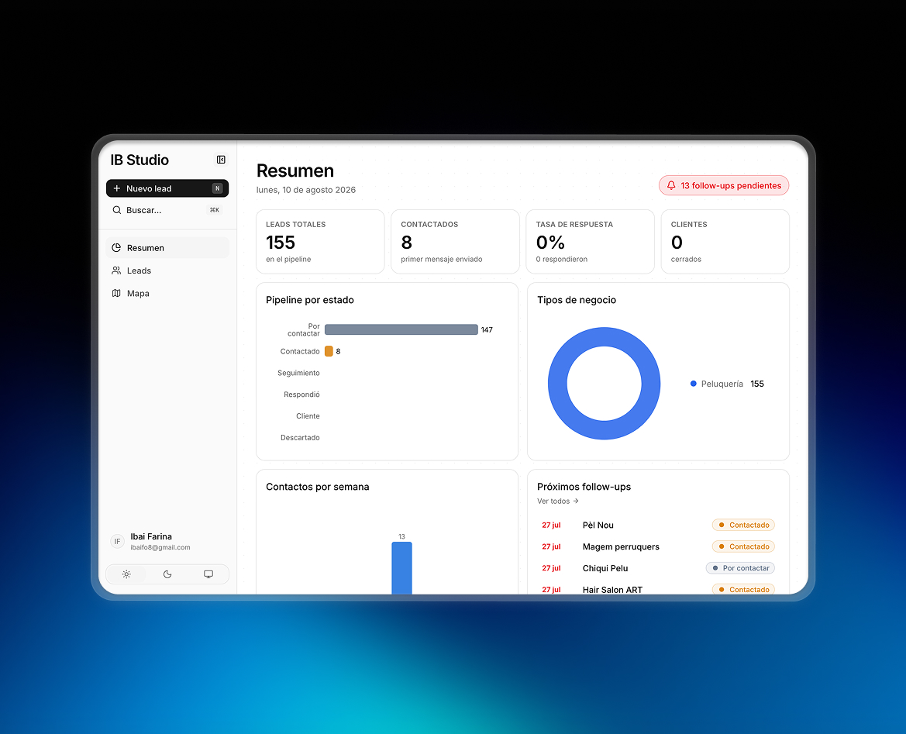
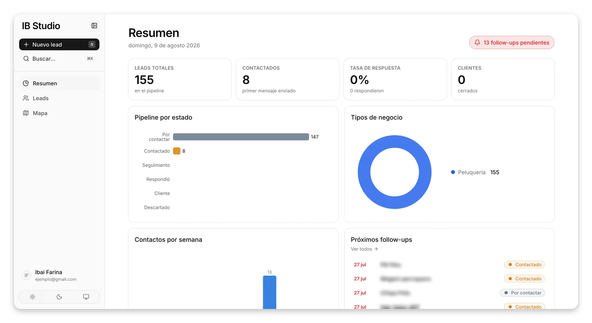
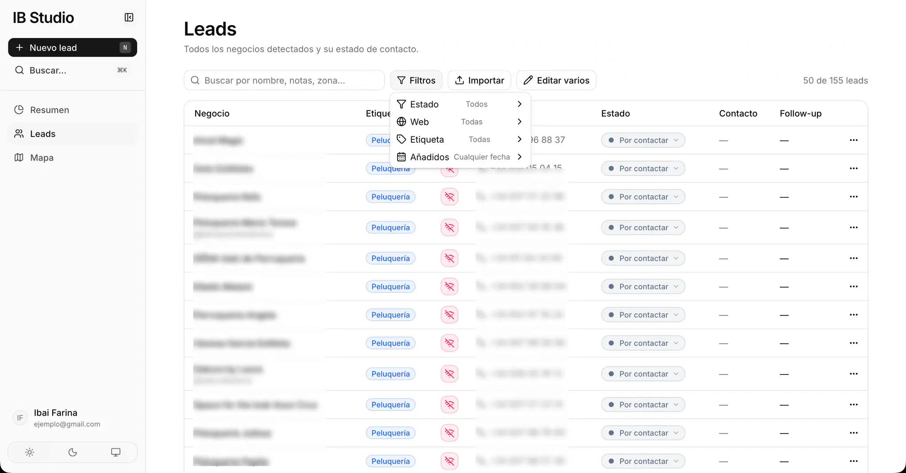
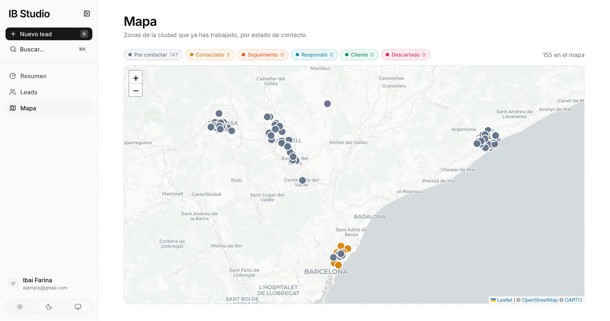
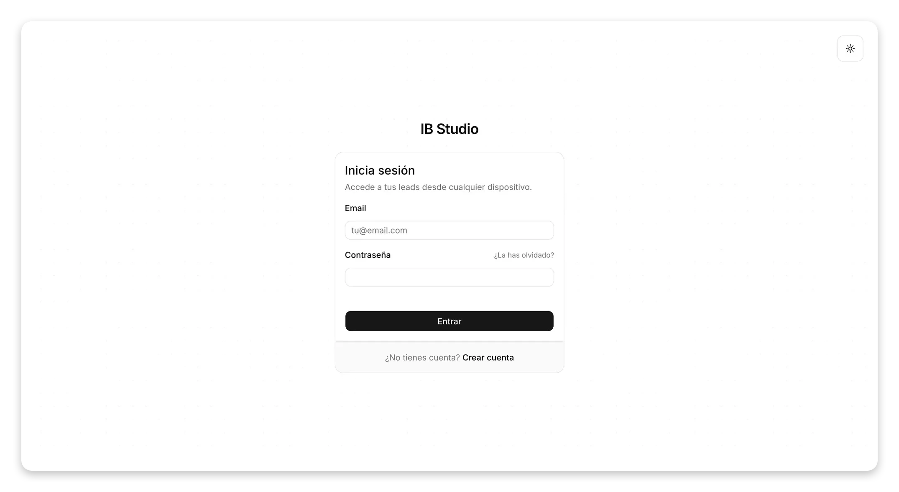
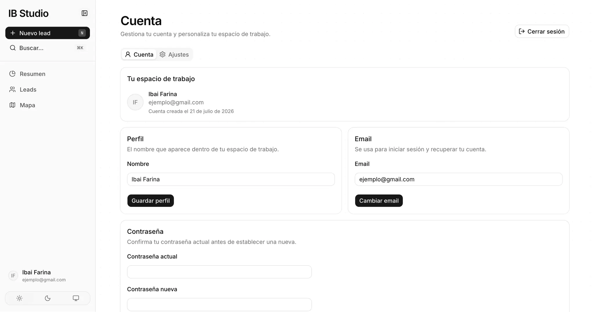

# IB Studio CRM



CRM full-stack para gestionar la prospección, captación y seguimiento de clientes, con dashboards, filtros, un mapa interactivo, autenticación y seguridad de datos por usuario.

[Ver el proyecto en ibaifarina.dev](https://www.ibaifarina.dev/projects/ib-studio-crm?from=%2Fprojects)

| Año | Rol | Stack | Etiquetas |
| --- | --- | --- | --- |
| 2026 | Developer & Designer | Next.js · TypeScript · Supabase · PostgreSQL | Full-stack · CRM · SaaS |

## Sobre el proyecto

**IB Studio CRM es una aplicación que desarrollé para gestionar mi propio proceso de prospección y captación de clientes.** Surgió de una necesidad real: poder centralizar los negocios que encuentro, registrar contactos, hacer seguimiento de cada lead y saber rápidamente en qué punto se encuentra cada oportunidad.

En lugar de llevar este proceso entre hojas de cálculo, notas y diferentes herramientas, decidí crear un CRM adaptado específicamente a mi forma de trabajar.

## Dashboard y seguimiento comercial

La aplicación cuenta con un **dashboard que resume el estado de la prospección**, mostrando KPIs, distribución de leads dentro del pipeline, actividad reciente y próximos follow-ups.

Esto me permite tener una visión rápida de cuántos negocios estoy trabajando, cuáles necesitan seguimiento y cómo evoluciona mi actividad comercial sin tener que revisar cada lead individualmente.



## Gestión de leads

El núcleo del CRM es una base de datos de negocios y potenciales clientes.

Desarrollé una tabla desde la que puedo **buscar, filtrar y editar rápidamente los leads**, actualizar su estado dentro del proceso de captación y almacenar la información necesaria para continuar el contacto posteriormente.

También incorporé estados específicos relacionados con la presencia web del negocio, algo especialmente útil al utilizar el CRM para prospectar clientes de desarrollo web.



## Mapa de negocios

Además de la vista tradicional en tabla, implementé una **visualización geográfica de los leads mediante un mapa interactivo**.

Los negocios se representan sobre el mapa y se diferencian visualmente según su estado dentro del proceso comercial, lo que facilita analizar dónde se encuentran los leads y organizar la prospección por zonas.

Para esta funcionalidad utilicé **Leaflet y React Leaflet**, junto con **Nominatim y OpenStreetMap para la geocodificación** de ubicaciones.



## Organización y productividad

También añadí funcionalidades pensadas para hacer más rápido el trabajo diario, como **etiquetas personalizadas para clasificar leads** y accesos rápidos para introducir nuevos negocios.

La aplicación incluye una interfaz de comandos accesible mediante atajos como `⌘K`, permitiendo realizar determinadas acciones sin depender constantemente de la navegación tradicional.

## Desarrollo full-stack

A nivel técnico, desarrollé el CRM con **Next.js 16, React 19 y TypeScript**, utilizando el App Router de Next.js. Para la interfaz trabajé con **Tailwind CSS y shadcn/ui**, creando una aplicación orientada a productividad más cercana a una herramienta SaaS que a una web convencional.

Para las visualizaciones de datos utilicé **Recharts**, mientras que Leaflet se encarga de toda la parte geográfica. También incorporé librerías específicas para fechas, comandos, notificaciones y otros componentes interactivos de la interfaz.

## Base de datos, autenticación y seguridad

La aplicación utiliza **Supabase como backend**, combinando PostgreSQL para la persistencia de datos con su sistema de autenticación.

Implementé registro, inicio de sesión, recuperación de contraseña y gestión de cuenta. Además, los datos están aislados mediante **Row-Level Security (RLS)**, de forma que cada usuario solo puede acceder a sus propios leads, etiquetas y datos asociados.

El proceso de autenticación también incorpora **Cloudflare Turnstile** como protección frente a bots y abuso durante el registro y acceso a la plataforma.

### Página de login y registro



### Gestión de la cuenta



## Resultado

Este proyecto nació como una herramienta para **resolver una necesidad que tenía en mi propio proceso de captación de clientes** y terminó convirtiéndose en una aplicación full-stack completa.

Me permitió trabajar en un producto con **autenticación, base de datos relacional, seguridad por usuario, visualización de datos, mapas interactivos, búsqueda, filtros y gestión de estados**, además de pensar la interfaz alrededor de un flujo de trabajo real.

Es uno de los proyectos que mejor representa mi interés por construir **herramientas útiles y productos digitales completos**, no únicamente interfaces visuales.

---

## Documentación técnica

### Stack

- **Next.js 16** (App Router) + **TypeScript**
- **Tailwind CSS v4** + **shadcn/ui**
- **Supabase**: PostgreSQL, autenticación y Row-Level Security
- **Leaflet** para el mapa · **Recharts** para las gráficas
- Geocodificación con **Nominatim** (OpenStreetMap)

### Configurar Supabase

1. Crea un proyecto en Supabase o instala Supabase desde Vercel Marketplace.
2. Abre el SQL Editor de Supabase y ejecuta, en orden, los archivos de `supabase/migrations/`.
3. Copia `.env.example` a `.env.local` y completa la URL y la publishable key desde el panel **Connect** del proyecto.
4. En **Authentication → URL Configuration**, configura:
   - Site URL local: `http://localhost:3000`
   - Redirect URL local: `http://localhost:3000/auth/callback`
   - Añade también `https://tu-dominio.vercel.app/auth/callback` al desplegar.
5. Crea un widget **Managed** en Cloudflare Turnstile y añade tu hostname de producción y `localhost` si vas a usar el mismo proyecto Supabase en local. Copia su **site key** en `NEXT_PUBLIC_TURNSTILE_SITE_KEY` tanto en `.env.local` como en Vercel.
6. En Supabase, abre **Authentication → Bot and Abuse Protection**, activa CAPTCHA, selecciona Cloudflare Turnstile y pega allí la **secret key**. La secret key no debe añadirse a las variables públicas de Next.js o Vercel.

Turnstile usa el modo `interaction-only`: la comprobación sucede en segundo plano y el reto solo se muestra cuando Cloudflare necesita interacción.

Para producción, configura un proveedor SMTP propio en Supabase para los emails de confirmación y recuperación de contraseña.

### Arrancar

```bash
npm install
npm run dev
```

Abre [http://localhost:3000](http://localhost:3000), crea una cuenta y confirma el email. No se importa ni se crea ningún dato inicial.

### Funcionalidades

- Registro, login, recuperación de contraseña y gestión de cuenta.
- Datos aislados por usuario con políticas RLS en todas las tablas.
- Resumen con KPIs, pipeline, actividad semanal y próximos follow-ups.
- Tabla de leads con búsqueda, filtros y edición rápida, incluido un estado específico para la web del negocio.
- Mapa de negocios coloreado por estado.
- Etiquetas por cuenta y entrada rápida con `N` o `⌘K`.
